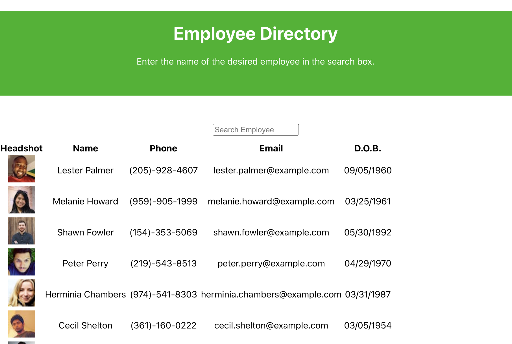
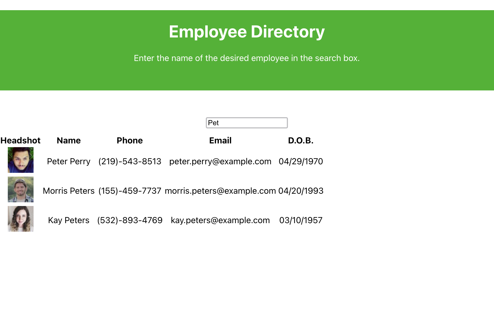

# Employee Directory

## Table of Contents

* Description
* Installation
* Usage
* Contributions
* Licensing
* Demo
* Questions

## Description

Using React, this application is a company directory that enables users to search through a roster of employees by matching name input in the search bar.

## Installation

Deployed application: https://jarretebarnett.github.io/directory

## Usage

As a user, I want to be able to view my entire employee directory at once so that I have quick access to their information.

## Contributions

No contributors on this project.

## Licensing

## Demo

## Questions

* You can follow my repositories at https://www.github.com/jarretebarnett
* For professional inquiries, you can email jarretebarnett@gmail.com